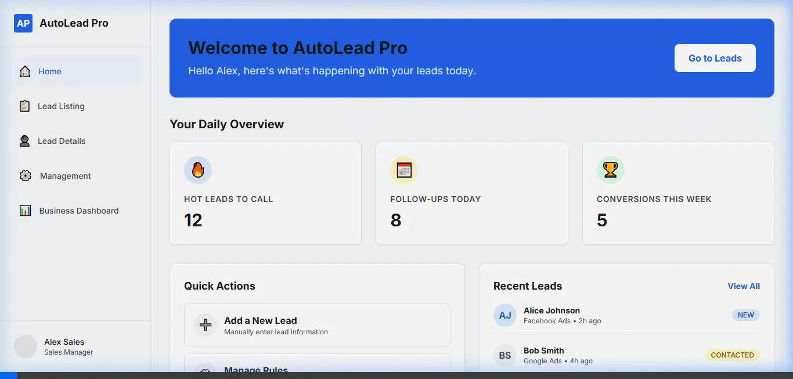

# 🚗 AutoLead Pro - CRM Dashboard (HSR Motors)

AutoLead Pro is a modern **lead management system UI** designed for HSR Motors to help sales teams efficiently track, manage, and convert customer leads coming from multiple sources like Facebook, Google Ads, Website forms, and offline events.

---

## 📸 Project Preview



---

## 🎯 Purpose of the Project

This project is a **UI/UX design prototype** for an internal CRM tool used by sales and business teams.

It focuses on:
- Managing customer leads efficiently
- Improving sales workflow
- Providing real-time lead status tracking
- Helping business managers analyze performance

---

## ⚡ Key Features

- 📋 Lead Listing Dashboard (All leads in one place)
- 👤 Detailed Lead View with history & notes
- 🔄 Lead Status Management (New / Contacted / Interested / Not Interested)
- 📊 Business Analytics Dashboard
- 🧑‍💼 Lead Assignment & Team Management
- ⚡ Clean and responsive CRM-style UI

---

## 🧩 Tech Stack

- ⚛️ React
- ⚡ Vite
- 🎨 CSS / UI Styling
- 🧹 ESLint (code quality)

---

## 🚀 Getting Started

Install dependencies:

```bash
npm install
